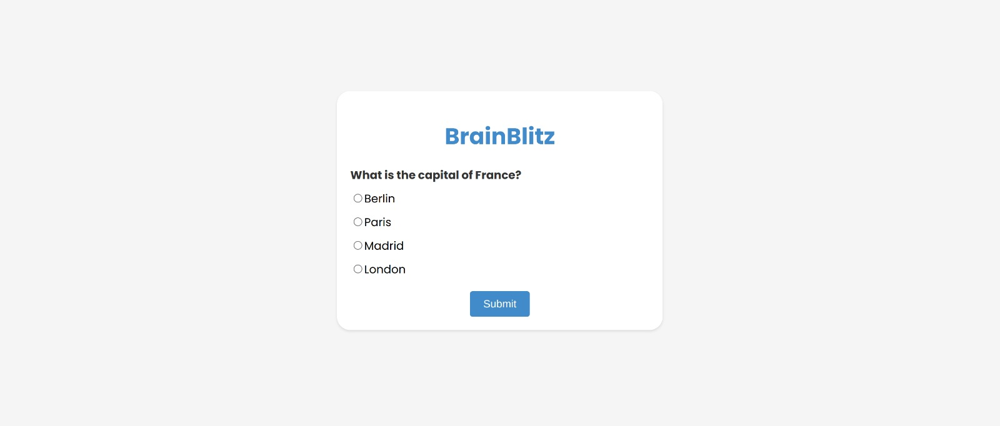

# BrainBlitz

BrainBlitz Quiz is a simple web-based quiz application that allows users to test their general knowledge by answering a series of multiple-choice questions. It provides users with a pleasant and user-friendly interface for taking quizzes.

## Features

- Multiple-choice questions with randomized answer options.
- Immediate feedback on the correctness of answers.
- A score counter that keeps track of the user's progress.
- The ability to retry the quiz or view the correct answers at the end.
